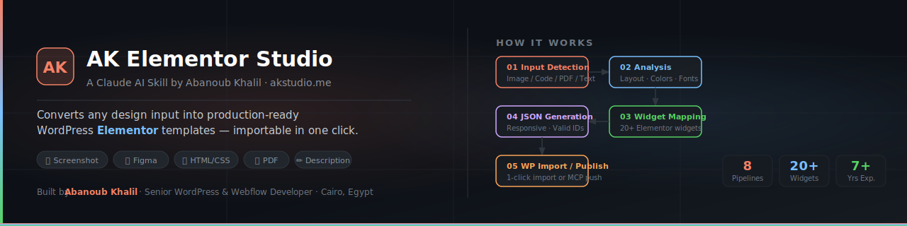

<p align="center">
  
</p>

<p align="center">
  <a href="https://akstudio.me"></a>
  <a href="https://github.com/abanoubkhalil/ak-elementor-studio/blob/main/LICENSE"></a>
  
  
  
</p>

<h3 align="center">Convert any design into a production-ready Elementor template — in minutes, not hours.</h3>

---

## What Is This?

**AK Elementor Studio** is a [Claude AI skill](https://docs.anthropic.com/en/docs/claude-code) that gives Claude the expert knowledge needed to convert *any* design input into valid WordPress Elementor JSON templates — importable directly into your WordPress site in one click.

It follows the same structured pipeline a senior Elementor developer uses: detect input → analyze layout → extract styles → map widgets → generate responsive JSON → validate output. But instead of taking hours, it takes minutes.

Built and maintained by **Abanoub Khalil**, Senior WordPress & Webflow Developer with 7+ years of experience at [akstudio.me](https://akstudio.me).

---

## Supported Input Types

| Input | What You Provide | Example |
|---|---|---|
| 📸 **Screenshot / Mockup** | Any PNG, JPG, WebP of a webpage or UI | Competitor page, inspiration screenshot |
| 🎨 **Figma Export** | Figma design, component export, `.fig` | Client's Figma file |
| 💻 **HTML / CSS / JS** | Code pasted or uploaded as file | Existing site code, a template you bought |
| 📄 **PDF** | Single or multi-page design document | Style guides, wireframe docs |
| ✏️ **Text Description** | Natural language description of the page | "A dark hero with a 3-column features grid" |
| 🔧 **Existing JSON** | An Elementor `.json` template to modify | Edit or extend templates you already have |

---

## How It Works

```
Your Input  →  Input Detection  →  Analysis Pipeline  →  Widget Mapping  →  JSON Generation  →  Import to WP
```

**Step 1 — Input Detection:** Identifies whether you provided an image, code, PDF, or text, and routes to the correct pipeline.

**Step 2 — Analysis:** Scans layout structure top-to-bottom. Extracts hex colors by visual estimation, estimates typography (font size, weight, family), maps column grids to Elementor's flex container structure.

**Step 3 — Widget Mapping:** Matches every visual element to the correct Elementor widget type — headings, icon boxes, testimonials, accordions, counters, carousels, and 20+ more.

**Step 4 — JSON Generation:** Outputs a complete, valid Elementor template JSON with:
- Unique 8-character hex IDs on every element
- Responsive settings for desktop, tablet, and mobile
- Placeholder images from `placehold.co`
- Elementor Pro feature flags (so you know what requires a license)

**Step 5 — Import or Publish:** Import the `.json` file manually, or use the WordPress MCP connector to push directly to your site as a draft.

---

## Installation

### Prerequisites
- [Claude Code](https://docs.anthropic.com/en/docs/claude-code) installed
- A WordPress site with Elementor (Free or Pro)

### Install the Skill

**Option A — Direct clone:**
```bash
git clone https://github.com/abanoubkhalil/ak-elementor-studio.git
```
Place the `ak-elementor-studio/` folder in your Claude skills directory.

**Option B — Manual download:**
1. Click **Code → Download ZIP** on this page
2. Extract and place the folder in your Claude skills directory

### That's it.
Once the skill file is in place, Claude will automatically detect and use it whenever you mention Elementor, WordPress, or upload a design file.

---

## Usage

Just describe what you want — Claude handles the rest:

```
"Convert this screenshot to an Elementor template"

"Build this Figma export as a WordPress page"

"Turn this HTML/CSS into an Elementor JSON file"

"Create an Elementor template: dark SaaS landing page, hero with gradient, 
3 feature cards, pricing section, CTA banner"

"Edit this existing template and change the hero background to #1A1A2E"
```

---

## Importing to WordPress

### Method 1 — Template Library *(Recommended)*
1. WordPress Dashboard → **Elementor → Templates → Saved Templates**
2. Click the **Import** icon (cloud/upload button)
3. Select the `.json` file → **Import**
4. Click **Insert** to add to any page

### Method 2 — Page Editor
1. Edit any page with Elementor
2. Click the **folder icon** (bottom-center panel)
3. Go to **My Templates** → **Import** → select the `.json` file

### Method 3 — Direct WordPress Publish via MCP
If you have the WordPress MCP connector connected to Claude:
```
"Convert this design and publish it directly to my WordPress site as a draft"
```
Claude will create the draft page and return the URL for you to review.

### Method 4 — WP-CLI *(Advanced)*
```bash
wp post create --post_type=elementor_library --post_status=publish --post_title="My Template"
wp post meta update <id> _elementor_data "$(cat template.json)"
wp post meta update <id> _elementor_edit_mode builder
```

---

## What's in This Repo

```
ak-elementor-studio/
│
├── SKILL.md                         ← Main skill instruction file (load this in Claude)
├── banner.svg                       ← This README's banner
├── README.md                        ← You are here
├── LICENSE                          ← MIT
│
└── references/
    ├── widget-map.md                ← Full JSON settings for every Elementor widget
    ├── style-map.md                 ← CSS property → Elementor JSON lookup table
    ├── visual-analysis.md           ← Deep guide for analyzing images/PDFs/screenshots
    └── section-patterns.md         ← Pre-built JSON for common page sections
```

### Key Files Explained

**`SKILL.md`** — The main instruction file. Contains all 8 pipelines (Code, Visual, PDF, Description, Edit, and more), the widget mapping table, output checklist, and common pitfalls. This is what Claude reads.

**`references/widget-map.md`** — Full JSON structure and settings for every Elementor widget, with visual trigger examples. Claude refers to this during JSON generation.

**`references/style-map.md`** — A complete CSS property → Elementor JSON settings translation table. Maps `background`, `color`, `font-*`, `padding`, `border`, `box-shadow` and more.

**`references/visual-analysis.md`** — A deep guide for analyzing images, PDFs, and screenshots into Elementor layout structure. Used by the Visual Pipeline.

**`references/section-patterns.md`** — Pre-built JSON patterns for common page sections (hero, features grid, testimonials, pricing, CTA, footer). Used as starting templates.

---

## Feature Highlights

- ✅ **All input types supported** — images, code, PDFs, Figma, text descriptions
- ✅ **Full responsive output** — desktop + tablet + mobile breakpoints on every element
- ✅ **Unique IDs guaranteed** — 8-character hex IDs, never duplicated
- ✅ **Elementor Free & Pro** — Pro features are flagged so you always know what's required
- ✅ **Output validation** — built-in checklist before every delivery
- ✅ **Direct WordPress publishing** — via WordPress MCP connector
- ✅ **Edit existing templates** — upload and modify any Elementor `.json` file
- ✅ **20+ widget types mapped** — from headings and buttons to accordions and carousels

---

## Elementor Free vs. Pro

The skill generates Free-compatible output by default. When Pro features are used (Custom CSS, Popup Builder, Scrolling Effects, Form Widget), the response includes:

```
⚠️ Pro Features Used:
- Custom CSS → Requires Elementor Pro
Free alternative: html widget with inline <style>
```

---

## About the Author

**Abanoub Khalil** — Senior WordPress & Webflow Developer

| | |
|---|---|
| 🌐 Portfolio | [akstudio.me](https://akstudio.me) |
| 📍 Location | Cairo, Egypt |
| 💼 Experience | 7+ years WordPress & Webflow |
| 🏢 Current Role | InVitro Capital — AllCare.ai, AllRx.ai |
| 🔧 Freelance | 13 live projects across Egypt & MENA |

---

## License

MIT — free to use, modify, and share. See [LICENSE](./LICENSE) for details.

---

## Contributing

Issues and pull requests are welcome. If you find a widget mapping that's missing, a JSON pattern that could be added to `section-patterns.md`, or a bug in the output — please open an issue.

---

<p align="center">
  If this skill saves you time, a ⭐ on the repo is always appreciated.<br/>
  <a href="https://akstudio.me">akstudio.me</a> · Built with 7 years of Elementor expertise
</p>
